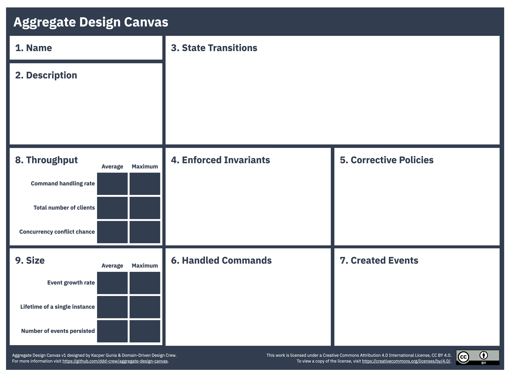
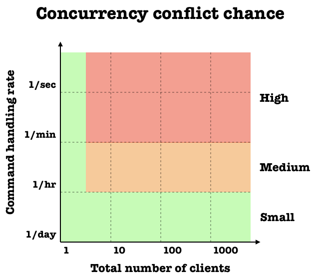
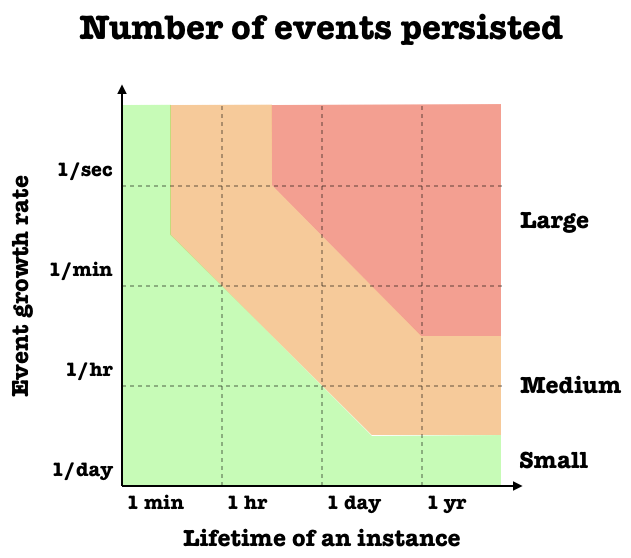

# The Aggregate Design Canvas

The Aggregate Design Canvas is a modelling tool meant to be used as a part of design-level domain modelling activities. 

An aggregate is a lifecycle pattern originally described by Eric Evans. By aggregate, we understand a graph of objects that is a consistency boundary for our domain policies. Depending on the design of the aggregate we can either enforce them (make them invariant) or be forced to have corrective policies in place. Because of that it is important to design the boundaries of aggregates well, as they impact behaviours modelled within our domain.

The canvas has a suggested order of working through it, that helps to iteratively discuss different aspects of the aggregate design.

[Aggregate Design Canvas (pdf)](resources/aggregate-design-canvas-v1.pdf "Aggregate Design Canvas")

## How to Use

### 1. Name
Give your aggregate a good name. In some domains it makes sense to include as part of the name the length of a cycle, or some other indication of the life span of the aggregate.

### 2. Description
Summarise the main responsibilities and purpose of the aggregate. It’s a good idea to include the reasons why such boundaries were chosen and tradeoffs that were made compared to other designs.

### 3. State Transitions

Usually the aggregate goes through explicit state transitions, that impact the way the way it can be interacted with. Too many transitions might indicate that process boundaries weren't modelled properly and can be split. Very naive / simple transitions might indicate that the aggregate is anaemic and that logic was pushed out to services. In this section list the possible states or draw a small transition diagram in this section of the canvas. 

### 4. Enforced Invariants & 5. Corrective Policies

One of the main jobs of the aggregate is to enforce business invariants. These invariants protect business logic and listing the main ones in this section will make sure that you agree on responsibilities that the aggregate has. Large numbers of enforced invariants can indicate high local complexity of the aggregate implementation.

Corrective policies are the ones that aggregate is involved with because you’ve made an explicit tradeoff to give up some invariants. A lot of corrective policies could indicate an increased complexity. Listing on the canvas both Invariants and Corrective Policies will make these design tradeoffs explicit. If you need a bit more information on the topic, please review the modelling business rules post from this blog.

### 6. Handled Commands & 7. Created Events

In this section you list all the commands that the aggregate is capable of handling and all events that will be created as a result. It might be a good idea to create connectors between them in order to validate that you are not missing any of the building blocks.

### 8. Throughput

Goal of this section is to estimate how likely a single aggregate instance is going to be involved in concurrency conflicts (when two or more competing callers try to make changes at the same time). For each metric estimate the average and maximum - it will help you to reason about the outliers as they often drive the boundary reevaluation.

The Command handling rate metric describes the rate at which the aggregate is processing new commands. On the other hand the Total number of clients says how many clients are likely to issue these commands.

To give you an example - if an aggregate models a basket on the website then it’s likely there will be only one client issuing commands to this basket. If we compare it to an aggregate that models a conference booking system then it’s likely we are going to have tens or hundreds of clients trying to book tickets.

#### Aggregate concurrency conflict chance evaluation chart

Putting these metrics on a graph will give you a rough estimate of a Concurrency conflict chance, which is what we are ultimately looking for. Plotting both Avg and Max for multiple alternatives will allow you to explicitly talk about the throughput tradeoffs. Generally speaking aiming for a small chance of conflict will deliver better customer experience, but will also increase the complexity of implementation. Or if we put it in a different way - bigger aggregates will have higher chance of concurrency conflict, but less policies to correct data.

### 9. Size

Last section of the canvas will help you estimate the hypothetical size of the aggregate. In this case the size itself is being measured in the number of events per aggregate instance. In some domains events are smaller, and in others much larger, so please remember about it during evaluation.

The Event growth rate metric should estimate how many events are appended to a single aggregate instance. The Lifetime of an instance will tell us how long the instance is going to live and as a consequence how many events will be accumulates and fetched when we need to process a new command.

#### Aggregate size evaluation chart

Medium and large number of events might impact the customer experience and make the command handling slow. Fortunately in most cases this can be dealt with using snapshots. Another thing to look for are long-lived instances (potentially infinite). This might cause problems when it comes to data archivization and ever growing streams. For that reason it’s usually a good heuristic to scope the aggregate to a specific time period (e.g. billing period).

## Additional Resources

- [Domain-Driven Design: A mathematical model for process-oriented Aggregates pt. I](https://medium.com/@tPl0ch/domain-driven-design-a-mathematical-model-for-process-oriented-aggregates-pt-i-6aecc8957865)
- [Modelling aggregates with "Aggregate Design Canvas"](https://domaincentric.net/blog/modelling-aggregates-with-aggregate-design-canvas)
- [Modelling Aggregates: Invariants vs Corrective Policies](https://domaincentric.net/blog/modelling-business-rules-invariants-vs-corrective-policies)

## Contributors

Thank you to the following individuals who have all contributed to the Aggregate Design Canvas:

- [Kacper Gunia](https://github.com/cakper)
- [Mathew McLoughlin](https://github.com/mat-mcloughlin)
- [Nick Tune](https://github.com/ntcoding)

The canvas was inspired by the [Bounded Context Canvas](https://github.com/ddd-crew/bounded-context-canvas).

## Contributions and Feedback

The Aggregate Design Canvas is freely available for you to use. In addition, your feedback and ideas are welcome to improve the canvas or to create new versions. 

Feel free to also send us a pull request with your examples.

[![CC BY 4.0][cc-by-shield]][cc-by]

This work is licensed under a [Creative Commons Attribution 4.0 International
License][cc-by].

[![CC BY 4.0][cc-by-image]][cc-by]

[cc-by]: http://creativecommons.org/licenses/by/4.0/
[cc-by-image]: https://i.creativecommons.org/l/by/4.0/88x31.png
[cc-by-shield]: https://img.shields.io/badge/License-CC%20BY%204.0-lightgrey.svg